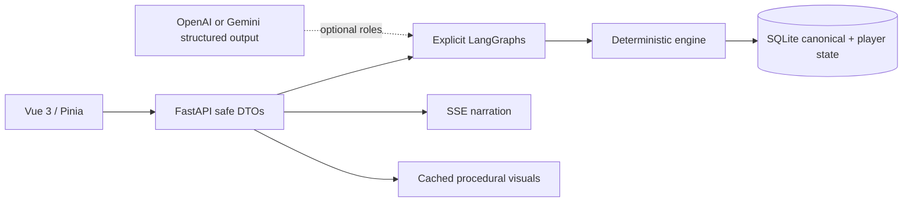

# CASE: UNKNOWN

A playable, Korean-first, single-player detective game where AI can create and narrate cases but deterministic software owns truth, discovery, state and verdicts. The included offline case, **Blackout Protocol**, needs no API key and can be played from opening to either resolution.

## Run

Requirements: Python 3.11+, Node 20+, `uv` (recommended).

```bash
cp .env.example .env
uv sync --extra dev
./.venv/bin/uvicorn backend.app.main:app --reload
```

In another terminal:

```bash
cd frontend
npm install
npm run dev
```

Open <http://localhost:5173>. Mock mode is on in `.env.example`, so API keys stay empty. Refresh restores the latest case from SQLite.

## Configuration

```dotenv
LLM_PROVIDER=gemini
GEMINI_API_KEY=
GEMINI_TEXT_MODEL=gemini-3.8-flash
OPENAI_API_KEY=
OPENAI_TEXT_MODEL=gpt-5.6-luna
CASE_GENERATOR_PROVIDER=openai
CASE_VALIDATOR_PROVIDER=gemini
ACTION_ROUTER_PROVIDER=
NPC_PROVIDER=
NARRATOR_PROVIDER=
CASE_GENERATOR_MODEL=
CASE_VALIDATOR_MODEL=
ACTION_ROUTER_MODEL=
NPC_MODEL=
NARRATOR_MODEL=
IMAGE_PROVIDER=placeholder
GEMINI_IMAGE_MODEL=gemini-3.1-flash-lite-image
USE_MOCK_LLM=true
DATABASE_URL=data/case_unknown.db
```

Set `USE_MOCK_LLM=false` and provide both keys. The default role routing is:

- OpenAI (`CASE_GENERATOR_PROVIDER=openai`): case generation and repair
- Gemini (`CASE_VALIDATOR_PROVIDER=gemini`): independent logic validation

Blank role providers fall back to `LLM_PROVIDER`. Provider-specific model defaults are `GEMINI_TEXT_MODEL` and `OPENAI_TEXT_MODEL`; role-specific model values override the selected provider's default. The legacy `GOOGLE_API_KEY` and `LLM_PROVIDER=google` values remain supported. Keys are read only by FastAPI and never appear in the public config or DTO. `IMAGE_PROVIDER=google` uses the Gemini key for generated images; `placeholder` images are free, deterministic and cached.

## Architecture



LangGraph supplies bounded, typed case-generation and investigation workflows; it is not a generic agent wrapper. LangChain's OpenAI and Gemini adapters are centralized by role and use Pydantic structured output. In mock mode, deterministic routing and dialogue make the complete game reproducible.

The central rule is that the model never mutates `CanonicalCase` or decides a verdict. The engine alone checks clue prerequisites, movement, locks, discovery, NPC knowledge and accusations. The browser receives `player_view()` and cannot inspect culprit, motive, method or solution until the game is over. See [system architecture](docs/system-architecture.md), [LangGraph design](docs/langgraph-design.md), and [AI boundaries](docs/ai-boundaries.md).

## Tests and quality

```bash
./.venv/bin/python -m pytest
./.venv/bin/ruff check backend
cd frontend
npm test
npm run lint
npm run build
```

The backend suite includes a real API mock-mode playthrough and leakage/injection checks. Frontend tests run with Vitest/jsdom. See [testing strategy](docs/testing-strategy.md).

## UI and design

The neo-noir desktop workspace uses case file, investigation and evidence-board columns, with an adapted single-column mobile layout. Procedural scene, suspect and evidence images are integrated into play. Pencil tooling was unavailable, so no invalid hand-authored `.pen` file was created; [the full Pencil-ready specification](docs/ui-ux-spec.md) is the design source until the integration is available.

## Limitations and roadmap

- The offline MVP has one deeply playable authored mystery; genre selection changes metadata, not the underlying plot.
- Real Gemini generation is wired but needs production prompt evaluation and broader repair benchmarks with a paid test key.
- No authentication or concurrent action versioning; deploy as local/single-player only.
- SSE streams the safely committed last event and is intentionally finite rather than a permanent event bus.
- Playwright is deferred until a browser-enabled environment is available.

Next: enable fully generated validated cases, implement Google image output with SVG fallback, add idempotency/version columns, add browser screenshot/E2E CI, then add player-authored evidence links and contradiction notes.
