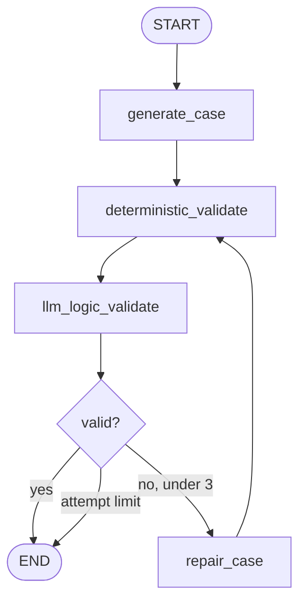
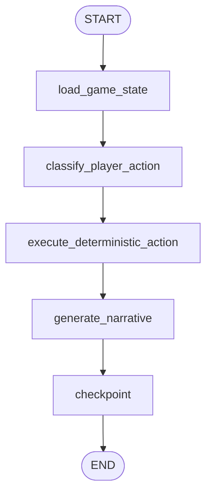

# LangGraph design

Both graphs have typed state and explicit nodes. FastAPI invokes them with a recursion limit of 12. In mock mode classification is deterministic. The centralized Gemini structured-output factory is ready for the case, validator, router, NPC and narrator roles; the canonical engine remains the only mutation path.
