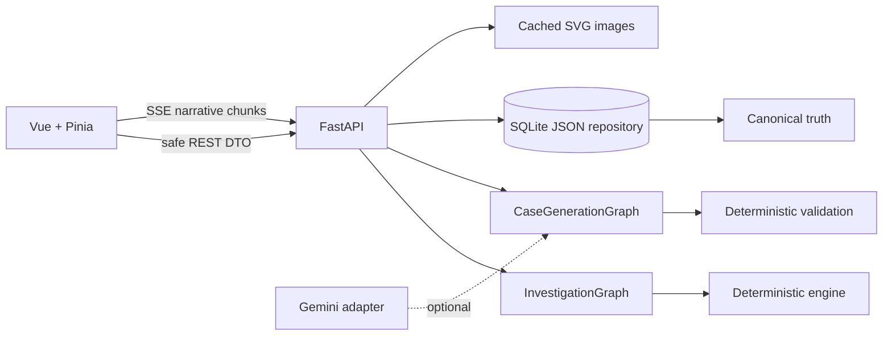
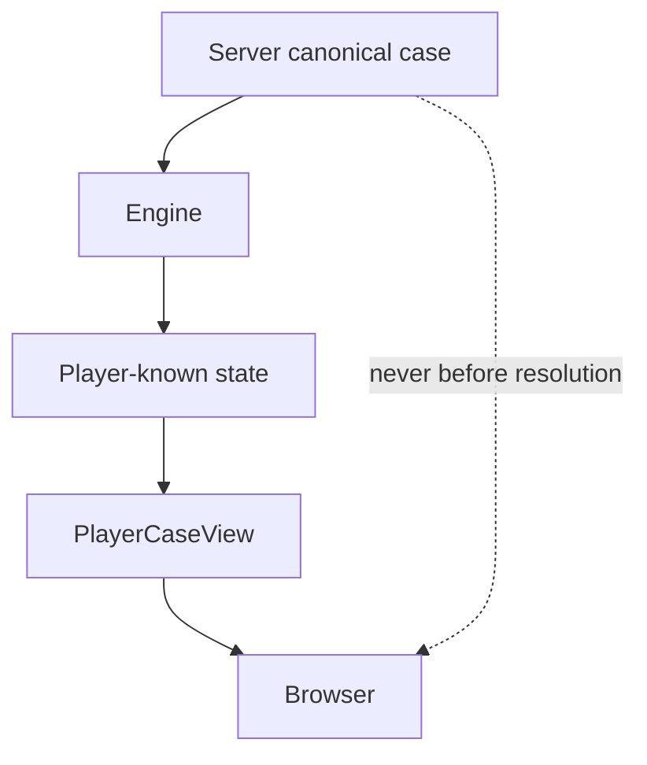

# System architecture

The repository is deliberately a small SQLite adapter, not an ORM. Canonical case and player state are separate Pydantic documents stored transactionally in one row. A refresh loads player state by case ID. State is committed before streaming begins.

